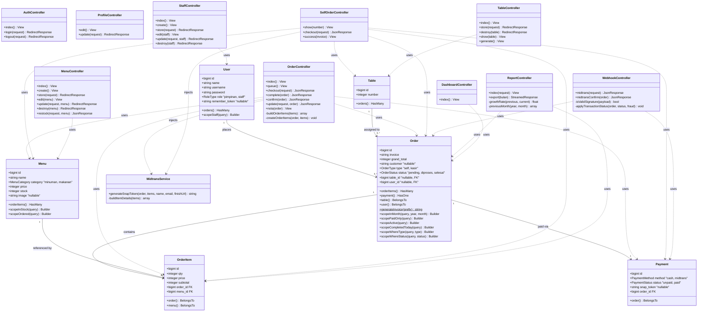

```mermaid
classDiagram
  class User {
    +bigint id
    +string name
    +string username
    +string password
    +RoleType role "pimpinan, staff"
    +string remember_token "nullable"
    +orders() HasMany
    +scopeStaff(query) Builder
  }

  class Menu {
    +bigint id
    +string name
    +MenuCategory category "minuman, makanan"
    +integer price
    +integer stock
    +string image "nullable"
    +orderItems() HasMany
    +scopeInStock(query) Builder
    +scopeOrdered(query) Builder
  }

  class Table {
    +bigint id
    +integer number
    +orders() HasMany
  }

  class Order {
    +bigint id
    +string invoice
    +integer grand_total
    +string customer "nullable"
    +OrderType type "self, kasir"
    +OrderStatus status "pending, diproses, selesai"
    +bigint table_id "nullable, FK"
    +bigint user_id "nullable, FK"
    +orderItems() HasMany
    +payment() HasOne
    +table() BelongsTo
    +user() BelongsTo
    +generateInvoice(prefix)$ string
    +scopeInMonth(query, year, month) Builder
    +scopePaidOnly(query) Builder
    +scopeActive(query) Builder
    +scopeCompletedToday(query) Builder
    +scopeWhereType(query, type) Builder
    +scopeWhereStatus(query, status) Builder
  }

  class OrderItem {
    +bigint id
    +integer qty
    +integer price
    +integer subtotal
    +bigint order_id FK
    +bigint menu_id FK
    +order() BelongsTo
    +menu() BelongsTo
  }

  class Payment {
    +bigint id
    +PaymentMethod method "cash, midtrans"
    +PaymentStatus status "unpaid, paid"
    +string snap_token "nullable"
    +bigint order_id FK
    +order() BelongsTo
  }

  class MidtransService {
    +generateSnapToken(order, items, name, email, finishUrl) string
    -buildItemDetails(items) array
  }

  class AuthController {
    +index() View
    +login(request) RedirectResponse
    +logout(request) RedirectResponse
  }

  class DashboardController {
    +index() View
  }

  class ProfileController {
    +edit() View
    +update(request) RedirectResponse
  }

  class ReportController {
    +index(request) View
    +export(bulan) StreamedResponse
    -growthRate(previous, current) float
    -previousMonth(year, month) array
  }

  class StaffController {
    +index() View
    +create() View
    +store(request) RedirectResponse
    +edit(staff) View
    +update(request, staff) RedirectResponse
    +destroy(staff) RedirectResponse
  }

  class MenuController {
    +index() View
    +create() View
    +store(request) RedirectResponse
    +edit(menu) View
    +update(request, menu) RedirectResponse
    +destroy(menu) RedirectResponse
    +restock(request, menu) JsonResponse
  }

  class TableController {
    +index() View
    +store(request) RedirectResponse
    +destroy(table) RedirectResponse
    +show(table) View
    +generate() View
  }

  class OrderController {
    +index() View
    +queue() View
    +checkout(request) JsonResponse
    +complete(order) JsonResponse
    +confirm(order) JsonResponse
    +update(request, order) JsonResponse
    +nota(order) View
    -buildOrderItems(items) array
    -createOrderItems(order, items) void
  }

  class SelfOrderController {
    +show(number) View
    +checkout(request) JsonResponse
    +success(invoice) View
  }

  class WebhookController {
    +midtrans(request) JsonResponse
    +midtransConfirm(order) JsonResponse
    -isValidSignature(payload) bool
    -applyTransactionStatus(order, status, fraud) void
  }

  User "1" --> "0..*" Order : places
  Table "1" --> "0..*" Order : assigned to
  Order "1" --> "1..*" OrderItem : contains
  Menu "1" --> "0..*" OrderItem : referenced by
  Order "1" --> "1" Payment : paid via

  OrderController ..> Order : uses
  OrderController ..> Menu : uses
  OrderController ..> Payment : uses
  OrderController ..> OrderItem : uses
  OrderController ..> MidtransService : injects

  SelfOrderController ..> Order : uses
  SelfOrderController ..> Menu : uses
  SelfOrderController ..> Table : uses
  SelfOrderController ..> Payment : uses
  SelfOrderController ..> OrderItem : uses
  SelfOrderController ..> MidtransService : injects

  WebhookController ..> Order : uses
  WebhookController ..> Payment : uses

  MenuController ..> Menu : uses
  TableController ..> Table : uses
  StaffController ..> User : uses
  ReportController ..> Order : uses
  ReportController ..> OrderItem : uses
  DashboardController ..> Order : uses
```
