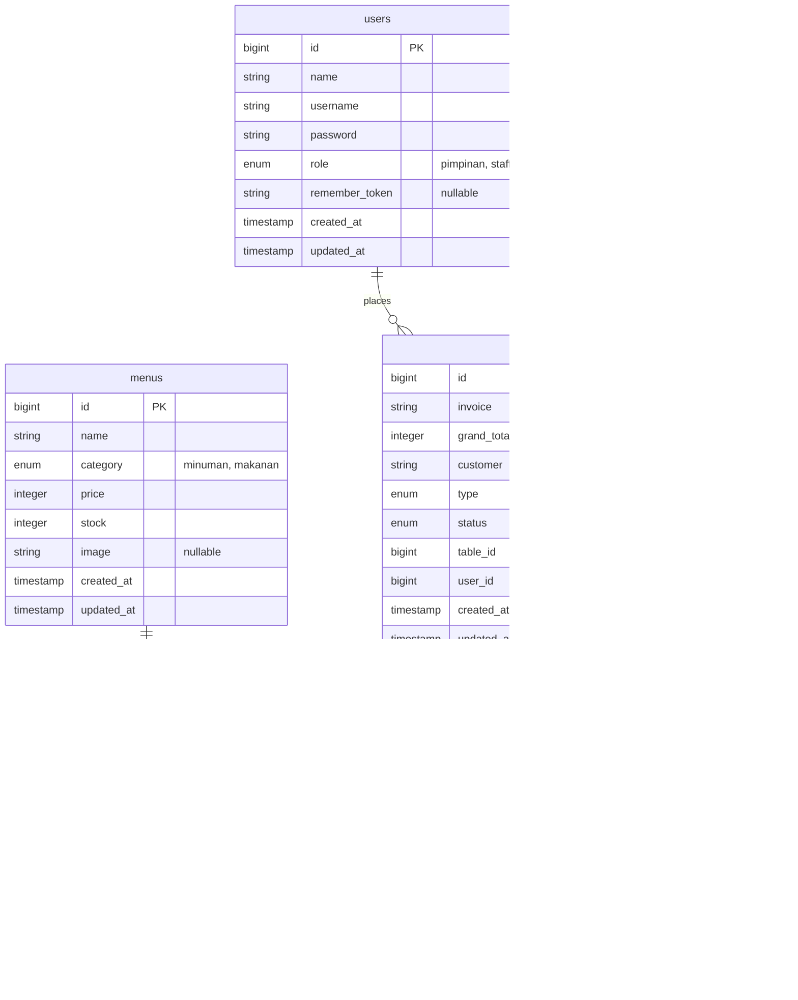

```mermaid
erDiagram
  users {
    bigint id PK
    string name
    string username
    string password
    enum role "pimpinan, staff"
    string remember_token "nullable"
    timestamp created_at
    timestamp updated_at
  }

  menus {
    bigint id PK
    string name
    enum category "minuman, makanan"
    integer price
    integer stock
    string image "nullable"
    timestamp created_at
    timestamp updated_at
  }

  tables {
    bigint id PK
    integer number
    timestamp created_at
    timestamp updated_at
  }

  orders {
    bigint id PK
    string invoice
    integer grand_total
    string customer "nullable"
    enum type "self, kasir"
    enum status "pending, diproses, selesai"
    bigint table_id FK "nullable"
    bigint user_id FK "nullable"
    timestamp created_at
    timestamp updated_at
  }

  order_items {
    bigint id PK
    integer qty
    integer price
    integer subtotal
    bigint order_id FK
    bigint menu_id FK
    timestamp created_at
    timestamp updated_at
  }

  payments {
    bigint id PK
    enum method "cash, midtrans"
    enum status "unpaid, paid"
    string snap_token "nullable"
    bigint order_id FK
    timestamp created_at
    timestamp updated_at
  }

  users ||--o{ orders : "places"
  tables ||--o{ orders : "assigned to"
  orders ||--o{ order_items : "contains"
  menus ||--o{ order_items : "referenced by"
  orders ||--|| payments : "paid via"
```
